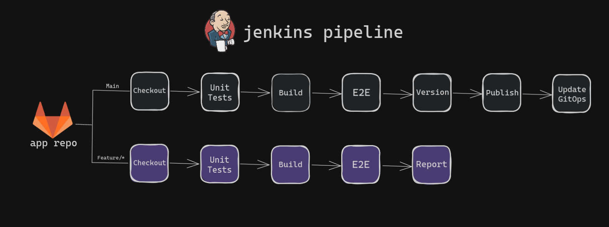
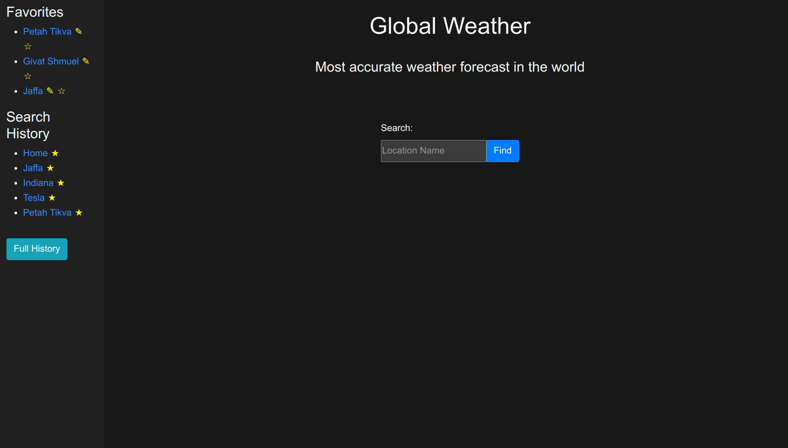

# Application Repository

This repository contains the source code for the **Task Tracker application** used in the DevOps portfolio project.

The application is built using **Python and Flask**, exposing a **REST API** that allows users to create, update, list, and delete tasks stored in a **MongoDB database**.

The repository also includes a **Jenkins pipeline**, **Docker configuration**, and **Nginx reverse proxy** setup used in the CI/CD pipeline and local development.

---

# Jenkins Pipeline



The Jenkins pipeline performs the following steps:

1. Run unit tests
2. Build the Docker image
3. Run end-to-end tests using Docker Compose
4. Tag and version the application
5. Push the Docker image to AWS ECR
6. Update the GitOps repository with the new image tag

---

# Application Demo



The application provides a simple **Task Tracker API** with the following endpoints:

| Method | Endpoint      | Description                |
| ------ | ------------- | -------------------------- |
| GET    | `/`           | Application status         |
| GET    | `/tasks`      | List all tasks             |
| POST   | `/tasks`      | Create a new task          |
| PUT    | `/tasks/<id>` | Update task status         |
| DELETE | `/tasks/<id>` | Delete a task              |
| GET    | `/ready`      | Kubernetes readiness probe |

Example request:

```bash
curl -X POST http://localhost:5000/tasks \
-H "Content-Type: application/json" \
-d '{"title":"Deploy Kubernetes cluster"}'
```
